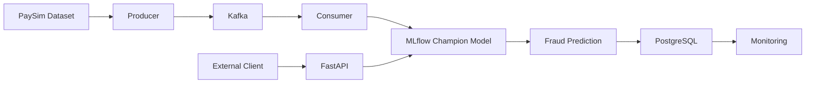

# Real-Time Fraud Detection & MLOps Platform

An end-to-end fraud detection system built with machine learning, real-time streaming, model versioning, API serving, database storage, monitoring, and CI.

## Architecture



## What the System Does

The platform can:

- Train an XGBoost fraud detection model
- Split data chronologically into train, validation, and test sets
- Tune the fraud probability threshold using F2 score
- Register and version models using MLflow
- Serve the current `champion` model through FastAPI
- Simulate real-time transaction streams using Kafka
- Automatically score incoming transactions
- Store predictions in PostgreSQL
- Monitor transaction and fraud statistics
- Run automated tests with pytest
- Run tests automatically on GitHub Actions

## Model Performance

Final test results:

| Metric | Score |
|---|---:|
| Precision | 1.0000 |
| Recall | 0.5424 |
| F2 Score | 0.5970 |
| Decision Threshold | 0.80 |

The validation threshold was selected using F2 score to place more emphasis on detecting fraudulent transactions.

## Technology Stack

- Python
- XGBoost
- scikit-learn
- Pandas
- FastAPI
- Apache Kafka
- PostgreSQL
- MLflow
- Docker
- Docker Compose
- pytest
- GitHub Actions

## Project Structure

```text
fraud-mlops-platform/
│
├── .github/
│   └── workflows/
│       └── ci.yml
│
├── src/
│   ├── api.py
│   ├── consumer.py
│   ├── monitor.py
│   ├── predict.py
│   ├── predict_registry.py
│   ├── producer.py
│   ├── register_model.py
│   └── train.py
│
├── tests/
│   └── test_predict.py
│
├── docker-compose.yml
├── requirements.txt
├── .gitignore
└── README.md
```

## Main Pipeline

```text
PaySim
   ↓
Producer
   ↓
Kafka
   ↓
Consumer
   ↓
MLflow Champion Model
   ↓
FRAUD / NORMAL
   ↓
PostgreSQL
   ↓
Monitoring
```

A separate API path is also available:

```text
Client
   ↓
FastAPI
   ↓
MLflow Champion Model
   ↓
Prediction
```

## Setup

Install dependencies:

```bash
pip install -r requirements.txt
```

Start Kafka and PostgreSQL:

```bash
docker compose up -d
```

Start MLflow:

```bash
mlflow server --host 127.0.0.1 --port 5000 --workers 1
```

Train the model:

```bash
python src/train.py
```

Register the model with MLflow:

```bash
python src/register_model.py
```

Start the FastAPI service:

```bash
uvicorn src.api:app --reload
```

FastAPI documentation:

```text
http://127.0.0.1:8000/docs
```

## Real-Time Streaming

Start the consumer first:

```bash
python -m src.consumer
```

Then start the producer:

```bash
python src/producer.py
```

The producer simulates incoming transactions from the PaySim dataset.

Kafka delivers each transaction to the consumer, which performs fraud prediction and stores the result in PostgreSQL.

## Monitoring

Run:

```bash
python src/monitor.py
```

The monitoring script reports:

- Total transactions
- Fraud predictions
- Normal predictions
- Fraud rate
- Average fraud probability
- Most recent fraud predictions

## Automated Testing

Run locally:

```bash
python -m pytest -q
```

GitHub Actions automatically runs the test suite whenever code is pushed or a pull request is created.

## MLflow

MLflow is used for:

- Experiment tracking
- Parameters and metrics
- Model artifacts
- Model Registry
- Model versioning
- `champion` model alias

Both FastAPI and the Kafka consumer use the model currently assigned to the `champion` alias.

## Dataset

This project uses the PaySim synthetic mobile money transaction dataset.

The dataset itself is not included in this repository because of its size.

## Current Scope

This repository represents version 1.0 of the platform.

The focus is on demonstrating an end-to-end machine learning engineering workflow including training, model management, real-time streaming, API serving, persistence, monitoring, containerized infrastructure, testing, and CI.