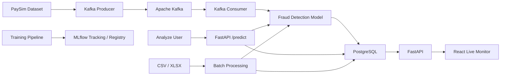
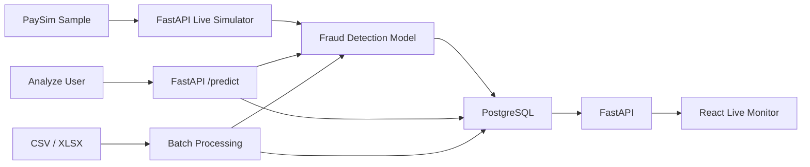

# Real-Time Fraud Detection & MLOps Platform

🌐 **Live Demo:** [Open Fraud Detection Platform](https://fraud-detection-platform-m2zu.onrender.com)

An end-to-end fraud detection platform built with machine learning, FastAPI, React, PostgreSQL, Apache Kafka, MLflow and Docker.

The platform supports individual transaction analysis, simulated live fraud monitoring, batch screening, persistent prediction storage, and MLOps workflows.

---

## Architecture

The project supports two live-processing modes.

### Local Development



### Render Deployment

The free Render deployment uses direct live simulation because a persistent Kafka broker is not included in the free deployment.



---

## Features

- XGBoost fraud detection model
- FastAPI REST API
- React + Vite frontend
- Single transaction analysis
- Simulated live fraud monitoring
- Apache Kafka streaming for local development
- Direct live simulation for Render deployment
- PostgreSQL prediction history
- CSV / XLSX batch screening
- Real batch-processing progress
- Fraud probability monitoring
- Prediction latency tracking
- Downloadable batch results
- MLflow experiment tracking
- MLflow Model Registry
- Docker Compose
- pytest automated testing
- GitHub Actions CI
- Cloud deployment with Render

---

## Live Demo

Frontend:

https://fraud-detection-platform-m2zu.onrender.com

The deployed application supports:

- Single transaction prediction
- Live simulated transaction monitoring
- Batch CSV / XLSX screening
- PostgreSQL prediction logging

> The Render free backend may take several seconds to wake up after a period of inactivity.

---

## Runtime Model

The application currently loads the trained model from:

```text
models/fraud_model.joblib
```

The prediction logic is implemented in:

```text
src/predict.py
```

Single transaction analysis, live monitoring, and batch screening use the same prediction function.

MLflow remains part of the project for experiment tracking, model registration, model versioning, and model-management workflows.

The current web application does not load the MLflow `champion` alias during normal inference.

---

## Model Inputs

The model uses six transaction fields:

```text
type
amount
oldbalanceOrg
newbalanceOrig
oldbalanceDest
newbalanceDest
```

Example:

```json
{
  "type": "TRANSFER",
  "amount": 10000,
  "oldbalanceOrg": 10000,
  "newbalanceOrig": 0,
  "oldbalanceDest": 0,
  "newbalanceDest": 10000
}
```

---

## Single Transaction Pipeline

```text
User
  ↓
React
  ↓
FastAPI /predict
  ↓
Fraud Detection Model
  ↓
Fraud Probability
  ↓
FRAUD / NORMAL
  ↓
PostgreSQL
```

Predictions created through the Analyze page are stored with:

```text
source = single
```

---

## Live Monitoring

### Local Mode

Local development uses Apache Kafka.

```text
PaySim Dataset
      ↓
Kafka Producer
      ↓
Apache Kafka
      ↓
Kafka Consumer
      ↓
Fraud Detection Model
      ↓
PostgreSQL
      ↓
FastAPI
      ↓
React Live Monitor
```

### Render Mode

The deployed Render version uses direct processing:

```text
PaySim Sample
      ↓
FastAPI Live Simulator
      ↓
Fraud Detection Model
      ↓
PostgreSQL
      ↓
React Live Monitor
```

Render automatically uses direct mode instead of attempting to connect to a local Kafka broker.

Live predictions are stored with:

```text
source = live
```

The live stream uses synthetic PaySim transactions and is not connected to a real banking transaction network.

---

## Batch Screening

```text
CSV / XLSX
      ↓
FastAPI Batch Job
      ↓
Fraud Detection Model
      ↓
Progress Tracking
      ↓
PostgreSQL
      ↓
Results
      ↓
CSV Download
```

Supported file formats:

```text
.csv
.xlsx
```

Required columns:

```text
type
amount
oldbalanceOrg
newbalanceOrig
oldbalanceDest
newbalanceDest
```

Batch predictions are stored with:

```text
source = batch
```

---

## PostgreSQL

Prediction history is stored in the PostgreSQL `transactions` table.

Stored information includes:

- Prediction source
- Transaction type
- Transaction amount
- Origin account balances
- Destination account balances
- Prediction result
- Fraud probability
- Inference latency
- Event timestamp
- Database creation timestamp

Prediction sources:

| Source | Description |
|---|---|
| `single` | Analyze page prediction |
| `live` | Live transaction simulation |
| `batch` | CSV / XLSX batch screening |

---

## Technology Stack

### Machine Learning

- Python
- XGBoost
- scikit-learn
- Pandas
- NumPy
- joblib
- MLflow

### Backend

- FastAPI
- Uvicorn
- PostgreSQL
- psycopg2
- Apache Kafka
- kafka-python

### Frontend

- React
- Vite
- JavaScript
- CSS

### Infrastructure

- Docker
- Docker Compose
- Render
- GitHub Actions
- pytest

---

## Project Structure

```text
fraud-mlops-platform/
├── .github/
│   └── workflows/
│       └── ci.yml
│
├── data/
│   └── paysim_sample.csv
│
├── frontend/
│   ├── public/
│   └── src/
│       ├── App.jsx
│       ├── App.css
│       ├── LiveMonitor.jsx
│       ├── LiveMonitor.css
│       ├── BatchScreening.jsx
│       ├── BatchScreening.css
│       ├── main.jsx
│       └── index.css
│
├── models/
│   └── fraud_model.joblib
│
├── src/
│   ├── api.py
│   ├── consumer.py
│   ├── db.py
│   ├── monitor.py
│   ├── predict.py
│   ├── predict_registry.py
│   ├── producer.py
│   ├── register_model.py
│   └── train.py
│
├── tests/
│   └── test_predict.py
│
├── docker-compose.yml
├── requirements.txt
├── .gitignore
└── README.md
```

---

## Dataset

The project uses the PaySim synthetic mobile-money transaction dataset.

The complete PaySim dataset is not stored in GitHub because of its size.

For local development, the full dataset can be placed at:

```text
data/PS_20174392719_1491204439457_log.csv
```

For the Render live demo, the repository contains a smaller sample:

```text
data/paysim_sample.csv
```

---

## Local Setup

### 1. Clone the Repository

```powershell
git clone https://github.com/kowchunxiang/fraud-mlops-platform.git
cd fraud-mlops-platform
```

### 2. Create Virtual Environment

```powershell
python -m venv .venv
.\.venv\Scripts\Activate.ps1
```

### 3. Install Dependencies

```powershell
python -m pip install -r requirements.txt
```

### 4. Start Kafka and PostgreSQL

Make sure Docker Desktop is running.

```powershell
docker compose up -d
```

This starts:

```text
Apache Kafka
PostgreSQL
```

### 5. Start FastAPI

```powershell
python -m uvicorn src.api:app --host 127.0.0.1 --port 8000
```

FastAPI documentation:

```text
http://127.0.0.1:8000/docs
```

### 6. Start React

Open another terminal:

```powershell
cd frontend
npm install
npm run dev
```

Frontend:

```text
http://localhost:5173
```

---

## Live Simulation

Open the **Live Monitor** page and click:

```text
Start Live Simulation
```

When running locally:

```text
PaySim → Kafka → Consumer → Model → PostgreSQL
```

When deployed on Render:

```text
PaySim Sample → Model → PostgreSQL
```

The user interface remains the same in both environments.

---

## API

### Health Check

```http
GET /health
```

### Single Prediction

```http
POST /predict
```

### Start Live Simulation

```http
POST /live/start
```

### Stop Live Simulation

```http
POST /live/stop
```

### Live Status

```http
GET /live/status
```

### Recent Live Transactions

```http
GET /live/transactions
```

### Batch Processing

```http
POST /batch-start
```

```http
GET /batch-status/{job_id}
```

```http
GET /batch-results/{job_id}
```

---

## View Recent Database Records

For local PostgreSQL:

```powershell
docker exec fraud-postgres psql -U fraud_user -d fraud_db -c "SELECT id, source, type, amount, prediction, fraud_probability, latency_ms, created_at FROM transactions ORDER BY created_at DESC LIMIT 5;"
```

Example result:

```text
 id | source | type     | amount   | prediction | fraud_probability
----+--------+----------+----------+------------+-------------------
 25 | live   | TRANSFER | 10000.00 | FRAUD      | 0.91
 24 | single | PAYMENT  | 500.00   | NORMAL     | 0.02
```

---

## MLflow

MLflow is used for:

- Experiment tracking
- Training parameters
- Evaluation metrics
- Model artifacts
- Model Registry
- Model versioning
- Optional `champion` model workflow

The current application runtime uses:

```text
models/fraud_model.joblib
```

MLflow is therefore used as the model-management layer rather than the current production inference source.

---

## Model Performance

Current documented test performance:

| Metric | Score |
|---|---:|
| Precision | 1.0000 |
| Recall | 0.5424 |
| F2 Score | 0.5970 |
| Decision Threshold | 0.80 |

---

## Testing

Run backend tests:

```powershell
python -m pytest -q
```

Build the frontend:

```powershell
cd frontend
npm run build
```

GitHub Actions automatically runs backend tests and frontend build checks after pushes and pull requests.

---

## Deployment

The cloud demo is deployed using Render.

```text
React Frontend
      ↓
Render Static Site

FastAPI + ML Model
      ↓
Render Web Service
      ↓
Render PostgreSQL
```

Frontend:

https://fraud-detection-platform-m2zu.onrender.com

The deployed live simulation runs without a cloud Kafka broker to remain compatible with Render's free deployment.

Kafka remains fully implemented and available in the local Docker development environment.

---

## Current Scope

This project is designed as a portfolio-scale end-to-end machine learning engineering and MLOps platform.

It demonstrates:

```text
Machine Learning
      +
REST API
      +
Real-Time Processing
      +
Database Persistence
      +
Frontend Application
      +
Batch Processing
      +
Model Management
      +
Containerization
      +
CI/CD
      +
Cloud Deployment
```

The transaction data is synthetic PaySim data.

The system is not connected to a real bank or payment network.

The current batch-processing job manager runs inside the FastAPI process and is intended for portfolio and demonstration workloads. A larger production deployment would normally use dedicated workers, a task queue, and managed streaming infrastructure.
